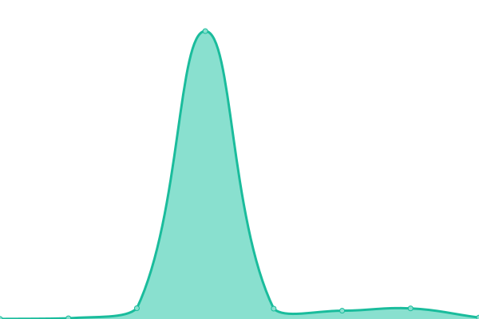
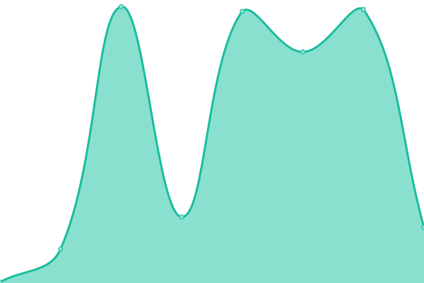
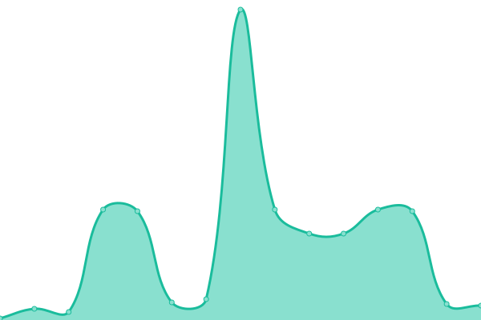
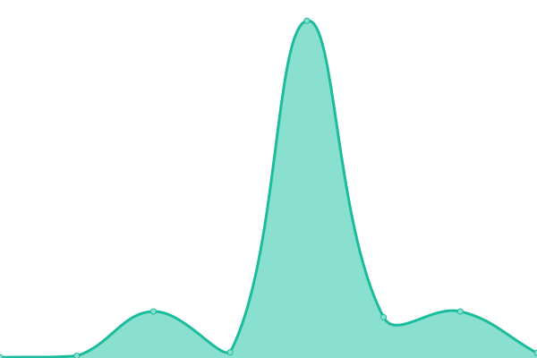
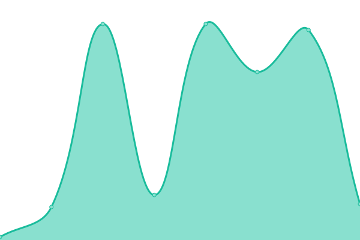

# [📈 Live Status](https://apm87.github.io/Nube): <!--live status--> **🟧 Partial outage**

This repository contains the open-source uptime monitor and status page for [apm87](https://apm87.github.io/Nube), powered by [Upptime](https://github.com/upptime/upptime).

With [Upptime](https://upptime.js.org), you can get your own unlimited and free uptime monitor and status page, powered entirely by a GitHub repository. We use [Issues](https://github.com/apm87/Nube/issues) as incident reports, [Actions](https://github.com/apm87/Nube/actions) as uptime monitors, and [Pages](https://apm87.github.io/Nube) for the status page.

<!--start: status pages-->
<!-- This summary is generated by Upptime (https://github.com/upptime/upptime) -->
<!-- Do not edit this manually, your changes will be overwritten -->
<!-- prettier-ignore -->
| URL | Status | History | Response Time | Uptime |
| --- | ------ | ------- | ------------- | ------ |
|  [Solvee-ACEInternacional](http://aceinternacional.solvee.cloud/) | 🟩 Up | [solvee-ace-internacional.yml](https://github.com/apm87/Nube/commits/HEAD/history/solvee-ace-internacional.yml) | 

 167ms
     
 | 

<a href="https://apm87.github.io/Nube/history/solvee-ace-internacional">100.00%</a>
    

|  [Solvee-DrJulioVargas](http://drjuliovargas.solvee.cloud/) | 🟩 Up | [solvee-dr-julio-vargas.yml](https://github.com/apm87/Nube/commits/HEAD/history/solvee-dr-julio-vargas.yml) | 

 161ms
     
 | 

<a href="https://apm87.github.io/Nube/history/solvee-dr-julio-vargas">100.00%</a>
    

|  [Solvee-Ofit](http://ofit.solvee.cloud/) | 🟩 Up | [solvee-ofit.yml](https://github.com/apm87/Nube/commits/HEAD/history/solvee-ofit.yml) | 

 165ms
     
 | 

<a href="https://apm87.github.io/Nube/history/solvee-ofit">100.00%</a>
    

|  [utmarthrosADm](https://utmarthros.citasturnos.com/UTMARTHROS/login.aspx) | 🟥 Down | [utmarthros-a-dm.yml](https://github.com/apm87/Nube/commits/HEAD/history/utmarthros-a-dm.yml) | 

 2976ms
     
 | 

<a href="https://apm87.github.io/Nube/history/utmarthros-a-dm">97.60%</a>
    

|  [utmarthrosWEB](https://utmarthros.citasturnos.com/UTMARTHROSWeb/welcome) | 🟩 Up | [utmarthros-web.yml](https://github.com/apm87/Nube/commits/HEAD/history/utmarthros-web.yml) | 

 330ms
     
 | 

<a href="https://apm87.github.io/Nube/history/utmarthros-web">100.00%</a>
    

|  [utmarthrosWEBService](https://utmarthros.citasturnos.com/UTMARTHROSWebService) | 🟥 Down | [utmarthros-web-service.yml](https://github.com/apm87/Nube/commits/HEAD/history/utmarthros-web-service.yml) | 

 1015ms
     
 | 

<a href="https://apm87.github.io/Nube/history/utmarthros-web-service">97.38%</a>
    

|  [TelePerformanceADM](https://teleperformance.citasturnos.com/Teleperformance/login.aspx) | 🟩 Up | [tele-performance-adm.yml](https://github.com/apm87/Nube/commits/HEAD/history/tele-performance-adm.yml) | 

 5852ms
     
 | 

<a href="https://apm87.github.io/Nube/history/tele-performance-adm">99.07%</a>
    

|  [TelePerformanceWEB](https://teleperformance.citasturnos.com/TeleperformanceWeb/welcome) | 🟩 Up | [tele-performance-web.yml](https://github.com/apm87/Nube/commits/HEAD/history/tele-performance-web.yml) | 

 269ms
     
 | 

<a href="https://apm87.github.io/Nube/history/tele-performance-web">100.00%</a>
    

|  [TelePerformanceWEBService](https://teleperformance.citasturnos.com/TeleperformanceWebService) | 🟩 Up | [tele-performance-web-service.yml](https://github.com/apm87/Nube/commits/HEAD/history/tele-performance-web-service.yml) | 

 1193ms
     
 | 

<a href="https://apm87.github.io/Nube/history/tele-performance-web-service">98.21%</a>
    

|  [MunicipioCasaresADM](https://municipiocasares.citasturnos.com/CitasOnline/login.aspx) | 🟥 Down | [municipio-casares-adm.yml](https://github.com/apm87/Nube/commits/HEAD/history/municipio-casares-adm.yml) | 

 5120ms
     
 | 

<a href="https://apm87.github.io/Nube/history/municipio-casares-adm">98.28%</a>
    

|  [MunicipioCasaresWEB](https://municipiocasares.citasturnos.com/CitasOnlineWeb/welcome) | 🟩 Up | [municipio-casares-web.yml](https://github.com/apm87/Nube/commits/HEAD/history/municipio-casares-web.yml) | 

 348ms
     
 | 

<a href="https://apm87.github.io/Nube/history/municipio-casares-web">100.00%</a>
    

|  [MunicipioCasaresWEBService](https://municipiocasares.citasturnos.com/CitasOnlineWS) | 🟩 Up | [municipio-casares-web-service.yml](https://github.com/apm87/Nube/commits/HEAD/history/municipio-casares-web-service.yml) | 

 1708ms
     
 | 

<a href="https://apm87.github.io/Nube/history/municipio-casares-web-service">99.19%</a>
    

|  [RepejuADM](https://repeju.citasturnos.com/REPEJU/login.aspx) | 🟩 Up | [repeju-adm.yml](https://github.com/apm87/Nube/commits/HEAD/history/repeju-adm.yml) | 

 4852ms
     
 | 

<a href="https://apm87.github.io/Nube/history/repeju-adm">98.72%</a>
    

|  [RepejuWEB](https://repeju.citasturnos.com/REPEJUWeb/welcome/) | 🟩 Up | [repeju-web.yml](https://github.com/apm87/Nube/commits/HEAD/history/repeju-web.yml) | 

 692ms
     
 | 

<a href="https://apm87.github.io/Nube/history/repeju-web">100.00%</a>
    

|  [RepejuWEBService](https://repeju.citasturnos.com/REPEJUWebService/) | 🟩 Up | [repeju-web-service.yml](https://github.com/apm87/Nube/commits/HEAD/history/repeju-web-service.yml) | 

 1249ms
     
 | 

<a href="https://apm87.github.io/Nube/history/repeju-web-service">97.52%</a>
    

|  [DraPaulaSolanoADM](https://drapaulasolano.citasturnos.com/DraPaulaSolano/login.aspx) | 🟩 Up | [dra-paula-solano-adm.yml](https://github.com/apm87/Nube/commits/HEAD/history/dra-paula-solano-adm.yml) | 

 1865ms
     
 | 

<a href="https://apm87.github.io/Nube/history/dra-paula-solano-adm">97.43%</a>
    

|  [DraPaulaSolanoWEB](https://drapaulasolano.citasturnos.com/DraPaulaSolanoWeb/welcome/) | 🟩 Up | [dra-paula-solano-web.yml](https://github.com/apm87/Nube/commits/HEAD/history/dra-paula-solano-web.yml) | 

 562ms
     
 | 

<a href="https://apm87.github.io/Nube/history/dra-paula-solano-web">100.00%</a>
    

|  [DraPaulaSolanoWEBService](https://drapaulasolano.citasturnos.com/DraPaulaSolanoWebService) | 🟥 Down | [dra-paula-solano-web-service.yml](https://github.com/apm87/Nube/commits/HEAD/history/dra-paula-solano-web-service.yml) | 

 1505ms
     
 | 

<a href="https://apm87.github.io/Nube/history/dra-paula-solano-web-service">98.03%</a>
    

|  [AmcaADM](https://amca.citasturnos.com/Amca/login.aspx) | 🟩 Up | [amca-adm.yml](https://github.com/apm87/Nube/commits/HEAD/history/amca-adm.yml) | 

 3052ms
     
 | 

<a href="https://apm87.github.io/Nube/history/amca-adm">99.58%</a>
    

|  [AmcaWEB](https://amca.citasturnos.com/AmcaWeb/welcome) | 🟩 Up | [amca-web.yml](https://github.com/apm87/Nube/commits/HEAD/history/amca-web.yml) | 

 278ms
     
 | 

<a href="https://apm87.github.io/Nube/history/amca-web">100.00%</a>
    

|  [AmcaWEBService](https://amca.citasturnos.com/AmcaWebService) | 🟩 Up | [amca-web-service.yml](https://github.com/apm87/Nube/commits/HEAD/history/amca-web-service.yml) | 

 1463ms
     
 | 

<a href="https://apm87.github.io/Nube/history/amca-web-service">99.00%</a>
    

|  [CombexADM](https://combex-im.citasturnos.com/CitasCombex-Im/login.aspx) | 🟩 Up | [combex-adm.yml](https://github.com/apm87/Nube/commits/HEAD/history/combex-adm.yml) | 

 4087ms
     
 | 

<a href="https://apm87.github.io/Nube/history/combex-adm">98.47%</a>
    

|  [CombexWEB](https://combex-im.citasturnos.com/CitasWebCOMBEX-IM/welcome) | 🟩 Up | [combex-web.yml](https://github.com/apm87/Nube/commits/HEAD/history/combex-web.yml) | 

 266ms
     
 | 

<a href="https://apm87.github.io/Nube/history/combex-web">100.00%</a>
    

|  [CombexWEBService](https://combex-im.citasturnos.com/CitasWebServiceCOMBEX-IM/) | 🟩 Up | [combex-web-service.yml](https://github.com/apm87/Nube/commits/HEAD/history/combex-web-service.yml) | 

 3160ms
     
 | 

<a href="https://apm87.github.io/Nube/history/combex-web-service">97.13%</a>
    

|  [OrbisADM](https://orbis.citasturnos.com/Orbis/login.aspx) | 🟥 Down | [orbis-adm.yml](https://github.com/apm87/Nube/commits/HEAD/history/orbis-adm.yml) | 

 6166ms
     
 | 

<a href="https://apm87.github.io/Nube/history/orbis-adm">99.14%</a>
    

|  [OrbisWEB](https://orbis.citasturnos.com/OrbisWeb/welcome) | 🟩 Up | [orbis-web.yml](https://github.com/apm87/Nube/commits/HEAD/history/orbis-web.yml) | 

 671ms
     
 | 

<a href="https://apm87.github.io/Nube/history/orbis-web">100.00%</a>
    

|  [OrbisWEBService](https://orbis.citasturnos.com/OrbisWS/) | 🟥 Down | [orbis-web-service.yml](https://github.com/apm87/Nube/commits/HEAD/history/orbis-web-service.yml) | 

 660ms
     
 | 

<a href="https://apm87.github.io/Nube/history/orbis-web-service">99.69%</a>
    

|  [UniversalADM](https://universal.citasturnos.com/Universal/login.aspx) | 🟩 Up | [universal-adm.yml](https://github.com/apm87/Nube/commits/HEAD/history/universal-adm.yml) | 

 4086ms
     
 | 

<a href="https://apm87.github.io/Nube/history/universal-adm">98.03%</a>
    

|  [UniversalWEB](https://universal.citasturnos.com/Universalweb/Welcome) | 🟩 Up | [universal-web.yml](https://github.com/apm87/Nube/commits/HEAD/history/universal-web.yml) | 

 313ms
     
 | 

<a href="https://apm87.github.io/Nube/history/universal-web">100.00%</a>
    

|  [UniversalWEBService](https://universal.citasturnos.com/UniversalWebService) | 🟩 Up | [universal-web-service.yml](https://github.com/apm87/Nube/commits/HEAD/history/universal-web-service.yml) | 

 1411ms
     
 | 

<a href="https://apm87.github.io/Nube/history/universal-web-service">99.03%</a>
    

|  [CEPMADM](https://CEPM.citasturnos.com/CEPM/login.aspx) | 🟩 Up | [cepmadm.yml](https://github.com/apm87/Nube/commits/HEAD/history/cepmadm.yml) | 

 3919ms
     
 | 

<a href="https://apm87.github.io/Nube/history/cepmadm">99.76%</a>
    

|  [CEPMWEB](https://CEPM.citasturnos.com/CEPMWeb/welcome) | 🟩 Up | [cepmweb.yml](https://github.com/apm87/Nube/commits/HEAD/history/cepmweb.yml) | 

 64ms
     
 | 

<a href="https://apm87.github.io/Nube/history/cepmweb">100.00%</a>
    

|  [CEPMWEBService](https://CEPM.citasturnos.com/CEPMWebService/) | 🟩 Up | [cepmweb-service.yml](https://github.com/apm87/Nube/commits/HEAD/history/cepmweb-service.yml) | 

 215ms
     
 | 

<a href="https://apm87.github.io/Nube/history/cepmweb-service">100.00%</a>
    

|  [AcertivaCPADM](https://asertivacp.citasturnos.com/AsertivaCP/login.aspx) | 🟥 Down | [acertiva-cpadm.yml](https://github.com/apm87/Nube/commits/HEAD/history/acertiva-cpadm.yml) | 

 6653ms
     
 | 

<a href="https://apm87.github.io/Nube/history/acertiva-cpadm">97.73%</a>
    

|  [AcertivaCPWEB](https://asertivacp.citasturnos.com/AsertivaCPWeb/welcome) | 🟩 Up | [acertiva-cpweb.yml](https://github.com/apm87/Nube/commits/HEAD/history/acertiva-cpweb.yml) | 

 409ms
     
 | 

<a href="https://apm87.github.io/Nube/history/acertiva-cpweb">100.00%</a>
    

|  [AcertivaCPWEBService](https://asertivacp.citasturnos.com/AsertivaCPWebService) | 🟩 Up | [acertiva-cpweb-service.yml](https://github.com/apm87/Nube/commits/HEAD/history/acertiva-cpweb-service.yml) | 

 3993ms
     
 | 

<a href="https://apm87.github.io/Nube/history/acertiva-cpweb-service">98.34%</a>
    

|  [DoctorCabreraADM](https://drcabrera.citasturnos.com/DrCabrera/login.aspx) | 🟩 Up | [doctor-cabrera-adm.yml](https://github.com/apm87/Nube/commits/HEAD/history/doctor-cabrera-adm.yml) | 

 2798ms
     
 | 

<a href="https://apm87.github.io/Nube/history/doctor-cabrera-adm">99.68%</a>
    

|  [DoctorCabreraWEB](https://drcabrera.citasturnos.com/DrCabreraWeb/welcome/) | 🟩 Up | [doctor-cabrera-web.yml](https://github.com/apm87/Nube/commits/HEAD/history/doctor-cabrera-web.yml) | 

 347ms
     
 | 

<a href="https://apm87.github.io/Nube/history/doctor-cabrera-web">100.00%</a>
    

|  [DoctorCabreraWEBService](https://drcabrera.citasturnos.com/DrCabreraWebService/) | 🟩 Up | [doctor-cabrera-web-service.yml](https://github.com/apm87/Nube/commits/HEAD/history/doctor-cabrera-web-service.yml) | 

 966ms
     
 | 

<a href="https://apm87.github.io/Nube/history/doctor-cabrera-web-service">99.43%</a>
    

|  [JurisdicciónInmobiliariaADM](https://jurisdiccioninmobiliaria.citasturnos.com/CitasJurisdiccionInmobiliaria/login.aspx) | 🟩 Up | [jurisdiccion-inmobiliaria-adm.yml](https://github.com/apm87/Nube/commits/HEAD/history/jurisdiccion-inmobiliaria-adm.yml) | 

 1808ms
     
 | 

<a href="https://apm87.github.io/Nube/history/jurisdiccion-inmobiliaria-adm">99.23%</a>
    

|  [JurisdicciónInmobiliariaWeb](https://jurisdiccioninmobiliaria.citasturnos.com/CitasWebJurisdiccionInmobiliaria/welcome) | 🟩 Up | [jurisdiccion-inmobiliaria-web.yml](https://github.com/apm87/Nube/commits/HEAD/history/jurisdiccion-inmobiliaria-web.yml) | 

 370ms
     
 | 

<a href="https://apm87.github.io/Nube/history/jurisdiccion-inmobiliaria-web">100.00%</a>
    

|  [JurisdicciónInmobiliariaWebService](https://jurisdiccioninmobiliaria.citasturnos.com/CitasWSJurisdiccionInmobiliaria/AppointmentWebService.asmx) | 🟩 Up | [jurisdiccion-inmobiliaria-web-service.yml](https://github.com/apm87/Nube/commits/HEAD/history/jurisdiccion-inmobiliaria-web-service.yml) | 

 729ms
     
 | 

<a href="https://apm87.github.io/Nube/history/jurisdiccion-inmobiliaria-web-service">98.86%</a>
    

|  [OrbisADM](https://orbis.citasturnos.com/Orbis/login.aspx) | 🟥 Down | [orbis-adm.yml](https://github.com/apm87/Nube/commits/HEAD/history/orbis-adm.yml) | 

 6166ms
     
 | 

<a href="https://apm87.github.io/Nube/history/orbis-adm">99.14%</a>
    

|  [OrbisWEB](https://orbis.citasturnos.com/OrbisWeb/welcome) | 🟩 Up | [orbis-web.yml](https://github.com/apm87/Nube/commits/HEAD/history/orbis-web.yml) | 

 671ms
     
 | 

<a href="https://apm87.github.io/Nube/history/orbis-web">100.00%</a>
    

|  [OrbisWEBService](https://orbis.citasturnos.com/OrbisWS/) | 🟥 Down | [orbis-web-service.yml](https://github.com/apm87/Nube/commits/HEAD/history/orbis-web-service.yml) | 

 660ms
     
 | 

<a href="https://apm87.github.io/Nube/history/orbis-web-service">99.69%</a>
    

<!--end: status pages-->

[**Visit our status website →**](https://apm87.github.io/Nube)

## 📄 License

- Powered by: [Upptime](https://github.com/upptime/upptime)
- Code: [MIT](./LICENSE) © [apm87](https://apm87.github.io/Nube)
- Data in the `./history` directory: [Open Database License](https://opendatacommons.org/licenses/odbl/1-0/)
