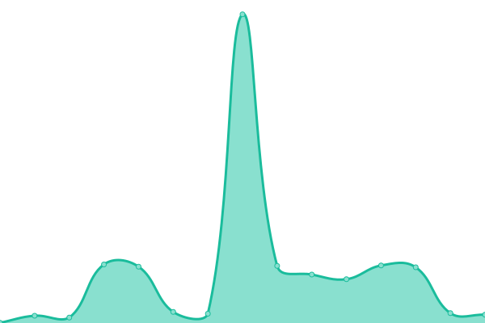
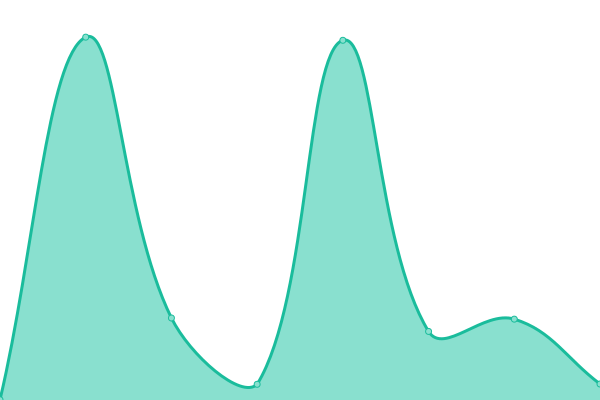
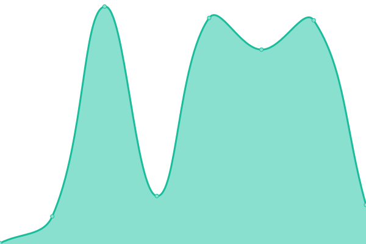

# [📈 Live Status](https://apm87.github.io/Nube): <!--live status--> **🟩 All systems operational**

This repository contains the open-source uptime monitor and status page for [apm87](https://apm87.github.io/Nube), powered by [Upptime](https://github.com/upptime/upptime).

With [Upptime](https://upptime.js.org), you can get your own unlimited and free uptime monitor and status page, powered entirely by a GitHub repository. We use [Issues](https://github.com/apm87/Nube/issues) as incident reports, [Actions](https://github.com/apm87/Nube/actions) as uptime monitors, and [Pages](https://apm87.github.io/Nube) for the status page.

<!--start: status pages-->
<!-- This summary is generated by Upptime (https://github.com/upptime/upptime) -->
<!-- Do not edit this manually, your changes will be overwritten -->
<!-- prettier-ignore -->
| URL | Status | History | Response Time | Uptime |
| --- | ------ | ------- | ------------- | ------ |
|  [RepejuADM](https://repeju.citasturnos.com/REPEJU/login.aspx) | 🟩 Up | [repeju-adm.yml](https://github.com/apm87/Nube/commits/HEAD/history/repeju-adm.yml) | 

 199ms
     
 | 

<a href="https://apm87.github.io/Nube/history/repeju-adm">100.00%</a>
    

|  [RepejuWEB](https://repeju.citasturnos.com/REPEJUWeb/welcome) | 🟩 Up | [repeju-web.yml](https://github.com/apm87/Nube/commits/HEAD/history/repeju-web.yml) | 

 41ms
     
 | 

<a href="https://apm87.github.io/Nube/history/repeju-web">100.00%</a>
    

|  [DraPaulaSolanoADM](https://drapaulasolano.citasturnos.com/DraPaulaSolano/login.aspx) | 🟩 Up | [dra-paula-solano-adm.yml](https://github.com/apm87/Nube/commits/HEAD/history/dra-paula-solano-adm.yml) | 

 195ms
     
 | 

<a href="https://apm87.github.io/Nube/history/dra-paula-solano-adm">100.00%</a>
    

|  [DraPaulaSolanoWEB](https://drapaulasolano.citasturnos.com/DraPaulaSolanoWeb/welcome) | 🟩 Up | [dra-paula-solano-web.yml](https://github.com/apm87/Nube/commits/HEAD/history/dra-paula-solano-web.yml) | 

 46ms
     
 | 

<a href="https://apm87.github.io/Nube/history/dra-paula-solano-web">100.00%</a>
    

|  [AmcaADMM](https://amca.citasturnos.com/Amca/login.aspx) | 🟩 Up | [amca-admm.yml](https://github.com/apm87/Nube/commits/HEAD/history/amca-admm.yml) | 

 192ms
     
 | 

<a href="https://apm87.github.io/Nube/history/amca-admm">100.00%</a>
    

|  [AmcaWEB](https://amca.citasturnos.com/AmcaWeb/welcome) | 🟩 Up | [amca-web.yml](https://github.com/apm87/Nube/commits/HEAD/history/amca-web.yml) | 

 34ms
     
 | 

<a href="https://apm87.github.io/Nube/history/amca-web">100.00%</a>
    

|  [CombexADM](https://combex-im.citasturnos.com/CitasCombex-Im/login.aspx) | 🟩 Up | [combex-adm.yml](https://github.com/apm87/Nube/commits/HEAD/history/combex-adm.yml) | 

 594ms
     
 | 

<a href="https://apm87.github.io/Nube/history/combex-adm">100.00%</a>
    

|  [CombexWEB](https://combex-im.citasturnos.com/CitasWebCOMBEX-IM/welcome) | 🟩 Up | [combex-web.yml](https://github.com/apm87/Nube/commits/HEAD/history/combex-web.yml) | 

 23ms
     
 | 

<a href="https://apm87.github.io/Nube/history/combex-web">100.00%</a>
    

|  [OrbisADM](https://orbis.citasturnos.com/Orbis/login.aspx) | 🟩 Up | [orbis-adm.yml](https://github.com/apm87/Nube/commits/HEAD/history/orbis-adm.yml) | 

 354ms
     
 | 

<a href="https://apm87.github.io/Nube/history/orbis-adm">100.00%</a>
    

|  [OrbisWEB](https://orbis.citasturnos.com/OrbisWeb/welcome) | 🟩 Up | [orbis-web.yml](https://github.com/apm87/Nube/commits/HEAD/history/orbis-web.yml) | 

 29ms
     
 | 

<a href="https://apm87.github.io/Nube/history/orbis-web">100.00%</a>
    

|  [UniversalADM](https://universal.citasturnos.com/Universal/login.aspx) | 🟩 Up | [universal-adm.yml](https://github.com/apm87/Nube/commits/HEAD/history/universal-adm.yml) | 

 1506ms
     
 | 

<a href="https://apm87.github.io/Nube/history/universal-adm">100.00%</a>
    

|  [UniversalWEB](https://universal.citasturnos.com/Universalweb) | 🟩 Up | [universal-web.yml](https://github.com/apm87/Nube/commits/HEAD/history/universal-web.yml) | 

 156ms
     
 | 

<a href="https://apm87.github.io/Nube/history/universal-web">100.00%</a>
    

|  [CEPMADM](https://CEPM.citasturnos.com/CEPM/login.aspx) | 🟩 Up | [cepmadm.yml](https://github.com/apm87/Nube/commits/HEAD/history/cepmadm.yml) | 

 1899ms
     
 | 

<a href="https://apm87.github.io/Nube/history/cepmadm">100.00%</a>
    

|  [CEPMWEB](https://CEPM.citasturnos.com/CEPMWeb/welcome) | 🟩 Up | [cepmweb.yml](https://github.com/apm87/Nube/commits/HEAD/history/cepmweb.yml) | 

 130ms
     
 | 

<a href="https://apm87.github.io/Nube/history/cepmweb">100.00%</a>
    

|  [AcertivaCPADM](https://asertivacp.citasturnos.com/AsertivaCP/login.aspx) | 🟩 Up | [acertiva-cpadm.yml](https://github.com/apm87/Nube/commits/HEAD/history/acertiva-cpadm.yml) | 

 240ms
     
 | 

<a href="https://apm87.github.io/Nube/history/acertiva-cpadm">99.54%</a>
    

|  [AcertivaCPWEB](https://asertivacp.citasturnos.com/AsertivaCPWeb/welcome) | 🟩 Up | [acertiva-cpweb.yml](https://github.com/apm87/Nube/commits/HEAD/history/acertiva-cpweb.yml) | 

 31ms
     
 | 

<a href="https://apm87.github.io/Nube/history/acertiva-cpweb">100.00%</a>
    

|  [AFP](https://afp.citasturnos.com/AFP_ReservasWeb/welcome) | 🟩 Up | [afp.yml](https://github.com/apm87/Nube/commits/HEAD/history/afp.yml) | 

 126ms
     
 | 

<a href="https://apm87.github.io/Nube/history/afp">100.00%</a>
    

|  [AFP](https://afp.citasturnos.com/AFP_ReservasWeb/welcome) | 🟩 Up | [afp.yml](https://github.com/apm87/Nube/commits/HEAD/history/afp.yml) | 

 126ms
     
 | 

<a href="https://apm87.github.io/Nube/history/afp">100.00%</a>
    

|  [DoctorCabreraCITASWEB](https://drcabrera.citasturnos.com/DrCabreraWeb/welcome) | 🟩 Up | [doctor-cabrera-citasweb.yml](https://github.com/apm87/Nube/commits/HEAD/history/doctor-cabrera-citasweb.yml) | 

 165ms
     
 | 

<a href="https://apm87.github.io/Nube/history/doctor-cabrera-citasweb">100.00%</a>
    

|  [DoctorCabreraCITASADM](https://drcabrera.citasturnos.com/DrCabrera/login.aspx) | 🟩 Up | [doctor-cabrera-citasadm.yml](https://github.com/apm87/Nube/commits/HEAD/history/doctor-cabrera-citasadm.yml) | 

 121ms
     
 | 

<a href="https://apm87.github.io/Nube/history/doctor-cabrera-citasadm">100.00%</a>
    

|  [JurisdicciónInmobiliaria](https://jurisdiccioninmobiliaria.citasturnos.com/CitasWebJurisdiccionInmobiliaria/welcome) | 🟩 Up | [jurisdiccion-inmobiliaria.yml](https://github.com/apm87/Nube/commits/HEAD/history/jurisdiccion-inmobiliaria.yml) | 

 276ms
     
 | 

<a href="https://apm87.github.io/Nube/history/jurisdiccion-inmobiliaria">100.00%</a>
    

|  [Orbis](https://orbis.citasturnos.com/OrbisWeb/welcome) | 🟩 Up | [orbis.yml](https://github.com/apm87/Nube/commits/HEAD/history/orbis.yml) | 

 103ms
     
 | 

<a href="https://apm87.github.io/Nube/history/orbis">100.00%</a>
    

|  [Servicop](https://servicoop.citasturnos.com/ServicoopWeb/welcome) | 🟩 Up | [servicop.yml](https://github.com/apm87/Nube/commits/HEAD/history/servicop.yml) | 

 148ms
     
 | 

<a href="https://apm87.github.io/Nube/history/servicop">100.00%</a>
    

|  [Universal](https://universal.citasturnos.com/Universalweb/welcome) | 🟩 Up | [universal.yml](https://github.com/apm87/Nube/commits/HEAD/history/universal.yml) | 

 171ms
     
 | 

<a href="https://apm87.github.io/Nube/history/universal">100.00%</a>
    

<!--end: status pages-->

[**Visit our status website →**](https://apm87.github.io/Nube)

## 📄 License

- Powered by: [Upptime](https://github.com/upptime/upptime)
- Code: [MIT](./LICENSE) © [apm87](https://apm87.github.io/Nube)
- Data in the `./history` directory: [Open Database License](https://opendatacommons.org/licenses/odbl/1-0/)
