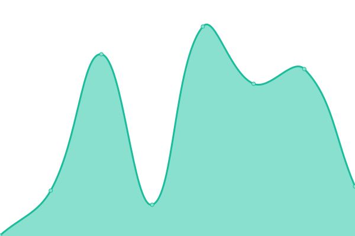
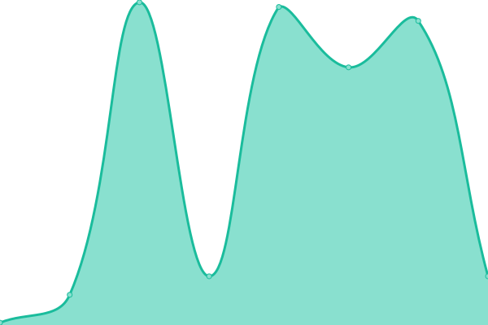
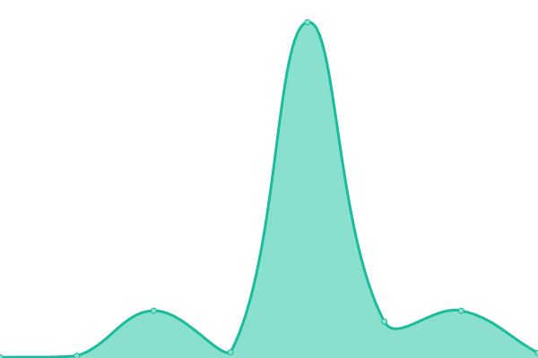
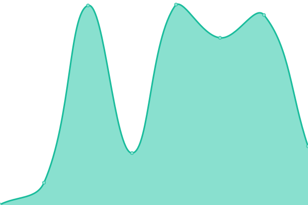

# [📈 Live Status](https://apm87.github.io/Nube): <!--live status--> **🟩 All systems operational**

This repository contains the open-source uptime monitor and status page for [apm87](https://apm87.github.io/Nube), powered by [Upptime](https://github.com/upptime/upptime).

With [Upptime](https://upptime.js.org), you can get your own unlimited and free uptime monitor and status page, powered entirely by a GitHub repository. We use [Issues](https://github.com/apm87/Nube/issues) as incident reports, [Actions](https://github.com/apm87/Nube/actions) as uptime monitors, and [Pages](https://apm87.github.io/Nube) for the status page.

<!--start: status pages-->
<!-- This summary is generated by Upptime (https://github.com/upptime/upptime) -->
<!-- Do not edit this manually, your changes will be overwritten -->
<!-- prettier-ignore -->
| URL | Status | History | Response Time | Uptime |
| --- | ------ | ------- | ------------- | ------ |
|  [Solvee-ACEInternacionaL](http://aceinternacional.solvee.cloud/) | 🟩 Up | [solvee-ace-internaciona-l.yml](https://github.com/apm87/Nube/commits/HEAD/history/solvee-ace-internaciona-l.yml) | 

 104ms
     
 | 

<a href="https://apm87.github.io/Nube/history/solvee-ace-internaciona-l">100.00%</a>
    

|  [Solvee-DrJulioVargas](http://drjuliovargas.solvee.cloud/) | 🟩 Up | [solvee-dr-julio-vargas.yml](https://github.com/apm87/Nube/commits/HEAD/history/solvee-dr-julio-vargas.yml) | 

 151ms
     
 | 

<a href="https://apm87.github.io/Nube/history/solvee-dr-julio-vargas">100.00%</a>
    

|  [Solvee-Ofit](http://ofit.solvee.cloud/) | 🟩 Up | [solvee-ofit.yml](https://github.com/apm87/Nube/commits/HEAD/history/solvee-ofit.yml) | 

 156ms
     
 | 

<a href="https://apm87.github.io/Nube/history/solvee-ofit">100.00%</a>
    

|  [utmarthrosADm](https://utmarthros.citasturnos.com/UTMARTHROS/login.aspx) | 🟩 Up | [utmarthros-a-dm.yml](https://github.com/apm87/Nube/commits/HEAD/history/utmarthros-a-dm.yml) | 

 5415ms
     
 | 

<a href="https://apm87.github.io/Nube/history/utmarthros-a-dm">93.40%</a>
    

|  [utmarthrosWEB](https://utmarthros.citasturnos.com/UTMARTHROSWeb/welcome) | 🟩 Up | [utmarthros-web.yml](https://github.com/apm87/Nube/commits/HEAD/history/utmarthros-web.yml) | 

 356ms
     
 | 

<a href="https://apm87.github.io/Nube/history/utmarthros-web">100.00%</a>
    

|  [utmarthrosWEBService](https://utmarthros.citasturnos.com/UTMARTHROSWebService) | 🟩 Up | [utmarthros-web-service.yml](https://github.com/apm87/Nube/commits/HEAD/history/utmarthros-web-service.yml) | 

 3665ms
     
 | 

<a href="https://apm87.github.io/Nube/history/utmarthros-web-service">93.68%</a>
    

|  [TelePerformanceADM](https://teleperformance.citasturnos.com/Teleperformance/login.aspx) | 🟩 Up | [tele-performance-adm.yml](https://github.com/apm87/Nube/commits/HEAD/history/tele-performance-adm.yml) | 

 8296ms
     
 | 

<a href="https://apm87.github.io/Nube/history/tele-performance-adm">97.67%</a>
    

|  [TelePerformanceWEB](https://teleperformance.citasturnos.com/TeleperformanceWeb/welcome) | 🟩 Up | [tele-performance-web.yml](https://github.com/apm87/Nube/commits/HEAD/history/tele-performance-web.yml) | 

 304ms
     
 | 

<a href="https://apm87.github.io/Nube/history/tele-performance-web">100.00%</a>
    

|  [TelePerformanceWEBService](https://teleperformance.citasturnos.com/TeleperformanceWebService) | 🟩 Up | [tele-performance-web-service.yml](https://github.com/apm87/Nube/commits/HEAD/history/tele-performance-web-service.yml) | 

 1959ms
     
 | 

<a href="https://apm87.github.io/Nube/history/tele-performance-web-service">94.96%</a>
    

|  [MunicipioCasaresADM](https://municipiocasares.citasturnos.com/CitasOnline/login.aspx) | 🟩 Up | [municipio-casares-adm.yml](https://github.com/apm87/Nube/commits/HEAD/history/municipio-casares-adm.yml) | 

 11802ms
     
 | 

<a href="https://apm87.github.io/Nube/history/municipio-casares-adm">96.40%</a>
    

|  [MunicipioCasaresWEB](https://municipiocasares.citasturnos.com/CitasOnlineWeb/welcome) | 🟩 Up | [municipio-casares-web.yml](https://github.com/apm87/Nube/commits/HEAD/history/municipio-casares-web.yml) | 

 310ms
     
 | 

<a href="https://apm87.github.io/Nube/history/municipio-casares-web">100.00%</a>
    

|  [MunicipioCasaresWEBService](https://municipiocasares.citasturnos.com/CitasOnlineWS) | 🟩 Up | [municipio-casares-web-service.yml](https://github.com/apm87/Nube/commits/HEAD/history/municipio-casares-web-service.yml) | 

 2596ms
     
 | 

<a href="https://apm87.github.io/Nube/history/municipio-casares-web-service">96.91%</a>
    

|  [RepejuADM](https://repeju.citasturnos.com/REPEJU/login.aspx) | 🟩 Up | [repeju-adm.yml](https://github.com/apm87/Nube/commits/HEAD/history/repeju-adm.yml) | 

 7593ms
     
 | 

<a href="https://apm87.github.io/Nube/history/repeju-adm">96.14%</a>
    

|  [RepejuWEB](https://repeju.citasturnos.com/REPEJUWeb/welcome/) | 🟩 Up | [repeju-web.yml](https://github.com/apm87/Nube/commits/HEAD/history/repeju-web.yml) | 

 675ms
     
 | 

<a href="https://apm87.github.io/Nube/history/repeju-web">100.00%</a>
    

|  [RepejuWEBService](https://repeju.citasturnos.com/REPEJUWebService/) | 🟩 Up | [repeju-web-service.yml](https://github.com/apm87/Nube/commits/HEAD/history/repeju-web-service.yml) | 

 2943ms
     
 | 

<a href="https://apm87.github.io/Nube/history/repeju-web-service">95.24%</a>
    

|  [DraPaulaSolanoADM](https://drapaulasolano.citasturnos.com/DraPaulaSolano/login.aspx) | 🟩 Up | [dra-paula-solano-adm.yml](https://github.com/apm87/Nube/commits/HEAD/history/dra-paula-solano-adm.yml) | 

 4451ms
     
 | 

<a href="https://apm87.github.io/Nube/history/dra-paula-solano-adm">93.30%</a>
    

|  [DraPaulaSolanoWEB](https://drapaulasolano.citasturnos.com/DraPaulaSolanoWeb/welcome/) | 🟩 Up | [dra-paula-solano-web.yml](https://github.com/apm87/Nube/commits/HEAD/history/dra-paula-solano-web.yml) | 

 561ms
     
 | 

<a href="https://apm87.github.io/Nube/history/dra-paula-solano-web">100.00%</a>
    

|  [DraPaulaSolanoWEBService](https://drapaulasolano.citasturnos.com/DraPaulaSolanoWebService) | 🟩 Up | [dra-paula-solano-web-service.yml](https://github.com/apm87/Nube/commits/HEAD/history/dra-paula-solano-web-service.yml) | 

 2490ms
     
 | 

<a href="https://apm87.github.io/Nube/history/dra-paula-solano-web-service">94.64%</a>
    

|  [AmcaADM](https://amca.citasturnos.com/Amca/login.aspx) | 🟩 Up | [amca-adm.yml](https://github.com/apm87/Nube/commits/HEAD/history/amca-adm.yml) | 

 4862ms
     
 | 

<a href="https://apm87.github.io/Nube/history/amca-adm">95.96%</a>
    

|  [AmcaWEB](https://amca.citasturnos.com/AmcaWeb/welcome) | 🟩 Up | [amca-web.yml](https://github.com/apm87/Nube/commits/HEAD/history/amca-web.yml) | 

 251ms
     
 | 

<a href="https://apm87.github.io/Nube/history/amca-web">100.00%</a>
    

|  [AmcaWEBService](https://amca.citasturnos.com/AmcaWebService) | 🟩 Up | [amca-web-service.yml](https://github.com/apm87/Nube/commits/HEAD/history/amca-web-service.yml) | 

 2324ms
     
 | 

<a href="https://apm87.github.io/Nube/history/amca-web-service">95.60%</a>
    

|  [CombexADM](https://combex-im.citasturnos.com/CitasCombex-Im/login.aspx) | 🟩 Up | [combex-adm.yml](https://github.com/apm87/Nube/commits/HEAD/history/combex-adm.yml) | 

 5795ms
     
 | 

<a href="https://apm87.github.io/Nube/history/combex-adm">93.90%</a>
    

|  [CombexWEB](https://combex-im.citasturnos.com/CitasWebCOMBEX-IM/welcome) | 🟩 Up | [combex-web.yml](https://github.com/apm87/Nube/commits/HEAD/history/combex-web.yml) | 

 302ms
     
 | 

<a href="https://apm87.github.io/Nube/history/combex-web">100.00%</a>
    

|  [CombexWEBService](https://combex-im.citasturnos.com/CitasWebServiceCOMBEX-IM/) | 🟩 Up | [combex-web-service.yml](https://github.com/apm87/Nube/commits/HEAD/history/combex-web-service.yml) | 

 2910ms
     
 | 

<a href="https://apm87.github.io/Nube/history/combex-web-service">94.51%</a>
    

|  [OrbisADM](https://orbis.citasturnos.com/Orbis/login.aspx) | 🟩 Up | [orbis-adm.yml](https://github.com/apm87/Nube/commits/HEAD/history/orbis-adm.yml) | 

 6557ms
     
 | 

<a href="https://apm87.github.io/Nube/history/orbis-adm">98.65%</a>
    

|  [OrbisWEB](https://orbis.citasturnos.com/OrbisWeb/welcome) | 🟩 Up | [orbis-web.yml](https://github.com/apm87/Nube/commits/HEAD/history/orbis-web.yml) | 

 563ms
     
 | 

<a href="https://apm87.github.io/Nube/history/orbis-web">100.00%</a>
    

|  [OrbisWEBService](https://orbis.citasturnos.com/OrbisWS/) | 🟩 Up | [orbis-web-service.yml](https://github.com/apm87/Nube/commits/HEAD/history/orbis-web-service.yml) | 

 941ms
     
 | 

<a href="https://apm87.github.io/Nube/history/orbis-web-service">97.05%</a>
    

|  [UniversalADM](https://universal.citasturnos.com/Universal/login.aspx) | 🟩 Up | [universal-adm.yml](https://github.com/apm87/Nube/commits/HEAD/history/universal-adm.yml) | 

 5566ms
     
 | 

<a href="https://apm87.github.io/Nube/history/universal-adm">93.49%</a>
    

|  [UniversalWEB](https://universal.citasturnos.com/Universalweb/Welcome) | 🟩 Up | [universal-web.yml](https://github.com/apm87/Nube/commits/HEAD/history/universal-web.yml) | 

 344ms
     
 | 

<a href="https://apm87.github.io/Nube/history/universal-web">99.96%</a>
    

|  [UniversalWEBService](https://universal.citasturnos.com/UniversalWebService) | 🟩 Up | [universal-web-service.yml](https://github.com/apm87/Nube/commits/HEAD/history/universal-web-service.yml) | 

 1853ms
     
 | 

<a href="https://apm87.github.io/Nube/history/universal-web-service">95.41%</a>
    

|  [CEPMADM](https://CEPM.citasturnos.com/CEPM/login.aspx) | 🟩 Up | [cepmadm.yml](https://github.com/apm87/Nube/commits/HEAD/history/cepmadm.yml) | 

 5746ms
     
 | 

<a href="https://apm87.github.io/Nube/history/cepmadm">95.48%</a>
    

|  [CEPMWEB](https://CEPM.citasturnos.com/CEPMWeb/welcome) | 🟩 Up | [cepmweb.yml](https://github.com/apm87/Nube/commits/HEAD/history/cepmweb.yml) | 

 139ms
     
 | 

<a href="https://apm87.github.io/Nube/history/cepmweb">99.97%</a>
    

|  [CEPMWEBService](https://CEPM.citasturnos.com/CEPMWebService/) | 🟩 Up | [cepmweb-service.yml](https://github.com/apm87/Nube/commits/HEAD/history/cepmweb-service.yml) | 

 1049ms
     
 | 

<a href="https://apm87.github.io/Nube/history/cepmweb-service">98.56%</a>
    

|  [AcertivaCPADM](https://asertivacp.citasturnos.com/AsertivaCP/login.aspx) | 🟩 Up | [acertiva-cpadm.yml](https://github.com/apm87/Nube/commits/HEAD/history/acertiva-cpadm.yml) | 

 7463ms
     
 | 

<a href="https://apm87.github.io/Nube/history/acertiva-cpadm">93.26%</a>
    

|  [AcertivaCPWEB](https://asertivacp.citasturnos.com/AsertivaCPWeb/welcome) | 🟩 Up | [acertiva-cpweb.yml](https://github.com/apm87/Nube/commits/HEAD/history/acertiva-cpweb.yml) | 

 367ms
     
 | 

<a href="https://apm87.github.io/Nube/history/acertiva-cpweb">100.00%</a>
    

|  [AcertivaCPWEBService](https://asertivacp.citasturnos.com/AsertivaCPWebService) | 🟩 Up | [acertiva-cpweb-service.yml](https://github.com/apm87/Nube/commits/HEAD/history/acertiva-cpweb-service.yml) | 

 3831ms
     
 | 

<a href="https://apm87.github.io/Nube/history/acertiva-cpweb-service">96.36%</a>
    

|  [DoctorCabreraADM](https://drcabrera.citasturnos.com/DrCabrera/login.aspx) | 🟩 Up | [doctor-cabrera-adm.yml](https://github.com/apm87/Nube/commits/HEAD/history/doctor-cabrera-adm.yml) | 

 2578ms
     
 | 

<a href="https://apm87.github.io/Nube/history/doctor-cabrera-adm">98.59%</a>
    

|  [DoctorCabreraWEB](https://drcabrera.citasturnos.com/DrCabreraWeb/welcome/) | 🟩 Up | [doctor-cabrera-web.yml](https://github.com/apm87/Nube/commits/HEAD/history/doctor-cabrera-web.yml) | 

 305ms
     
 | 

<a href="https://apm87.github.io/Nube/history/doctor-cabrera-web">100.00%</a>
    

|  [DoctorCabreraWEBService](https://drcabrera.citasturnos.com/DrCabreraWebService/) | 🟩 Up | [doctor-cabrera-web-service.yml](https://github.com/apm87/Nube/commits/HEAD/history/doctor-cabrera-web-service.yml) | 

 1354ms
     
 | 

<a href="https://apm87.github.io/Nube/history/doctor-cabrera-web-service">97.20%</a>
    

|  [JurisdicciónInmobiliariaADM](https://jurisdiccioninmobiliaria.citasturnos.com/CitasJurisdiccionInmobiliaria/login.aspx) | 🟩 Up | [jurisdiccion-inmobiliaria-adm.yml](https://github.com/apm87/Nube/commits/HEAD/history/jurisdiccion-inmobiliaria-adm.yml) | 

 6905ms
     
 | 

<a href="https://apm87.github.io/Nube/history/jurisdiccion-inmobiliaria-adm">95.77%</a>
    

|  [JurisdicciónInmobiliariaWeb](https://jurisdiccioninmobiliaria.citasturnos.com/CitasWebJurisdiccionInmobiliaria/welcome) | 🟩 Up | [jurisdiccion-inmobiliaria-web.yml](https://github.com/apm87/Nube/commits/HEAD/history/jurisdiccion-inmobiliaria-web.yml) | 

 325ms
     
 | 

<a href="https://apm87.github.io/Nube/history/jurisdiccion-inmobiliaria-web">100.00%</a>
    

|  [JurisdicciónInmobiliariaWebService](https://jurisdiccioninmobiliaria.citasturnos.com/CitasWSJurisdiccionInmobiliaria/AppointmentWebService.asmx) | 🟩 Up | [jurisdiccion-inmobiliaria-web-service.yml](https://github.com/apm87/Nube/commits/HEAD/history/jurisdiccion-inmobiliaria-web-service.yml) | 

 2984ms
     
 | 

<a href="https://apm87.github.io/Nube/history/jurisdiccion-inmobiliaria-web-service">96.87%</a>
    

|  [OrbisADM](https://orbis.citasturnos.com/Orbis/login.aspx) | 🟩 Up | [orbis-adm.yml](https://github.com/apm87/Nube/commits/HEAD/history/orbis-adm.yml) | 

 6557ms
     
 | 

<a href="https://apm87.github.io/Nube/history/orbis-adm">98.65%</a>
    

|  [OrbisWEB](https://orbis.citasturnos.com/OrbisWeb/welcome) | 🟩 Up | [orbis-web.yml](https://github.com/apm87/Nube/commits/HEAD/history/orbis-web.yml) | 

 563ms
     
 | 

<a href="https://apm87.github.io/Nube/history/orbis-web">100.00%</a>
    

|  [OrbisWEBService](https://orbis.citasturnos.com/OrbisWS/) | 🟩 Up | [orbis-web-service.yml](https://github.com/apm87/Nube/commits/HEAD/history/orbis-web-service.yml) | 

 941ms
     
 | 

<a href="https://apm87.github.io/Nube/history/orbis-web-service">97.05%</a>
    

<!--end: status pages-->

[**Visit our status website →**](https://apm87.github.io/Nube)

## 📄 License

- Powered by: [Upptime](https://github.com/upptime/upptime)
- Code: [MIT](./LICENSE) © [apm87](https://apm87.github.io/Nube)
- Data in the `./history` directory: [Open Database License](https://opendatacommons.org/licenses/odbl/1-0/)
